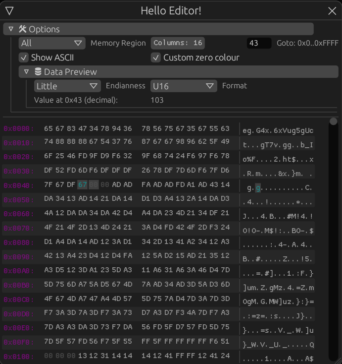
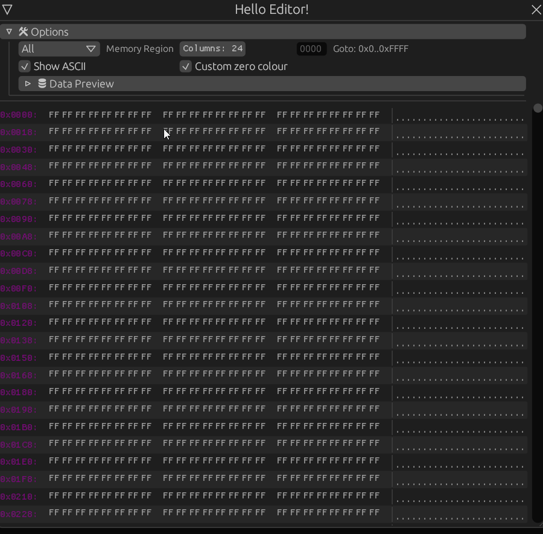

# Egui Memory Editor
[](https://crates.io/crates/egui_memory_editor)
[](https://docs.rs/egui_memory_editor)

This is a simple memory editor/viewer utility for the immediate mode UI library [egui](https://crates.io/crates/egui)



## Features
* Multiple memory regions with different address ranges can be created.
* Can jump to an arbitrary address using the goto functions.
* Can select certain values in the main UI by right-clicking, which you can then see in the `Data Preview` section.
* Can have an optional write function to allow editing fields by left clicking on them.

## Usage
It's best to look at the example in the `examples/` folder, but one can initialise the editor with any struct of their choosing.

For example, a custom memory struct:
```rust
let mut memory = Memory::new();
// Create a memory editor with a variety of ranges, need at least one, but can be as many as you want.
let mut mem_editor = MemoryEditor::new()
.with_address_range("All", 0..0xFFFF)
.with_address_range("IO", 0xFF00..0xFF80)
.with_window_title("Hello Editor!");

// In your egui rendering simply include the following.
// The write function is optional, if you don't set it the UI will be in read-only mode.
let mut is_open = true;
mem_editor.window_ui(
    ctx,
    &mut is_open,
    &mut memory,
    |mem, address| mem.read_value(address).into(),
    |mem, address, val| mem.write_value(address, val),
);
```

## Running example
To run the example do the following:

1. `git clone https://github.com/Hirtol/egui_memory_editor`
2. `cd egui_memory_editor`
3. `cargo run --example simple --release`

## Feature Showcase

